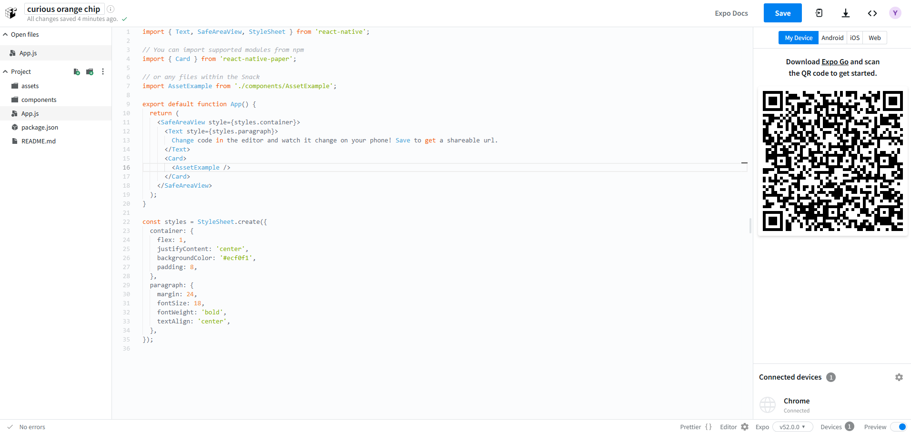

# React-Native

## 소프트웨어 요구사항(Software Requirements)
<details>
<summary>펼치기 접기</summary>

React Native의 가장 큰 단점 중 하나는 초기 셋업의 복잡함이다.  

React Native로 애플리케이션을 만든다는 것은 모바일 웹 애플리케이션을 만드는 것과 다르다.  
즉, 실제 iOS와 안드로이드 앱을 만드는 것이며, 이는 앱 개발에 필요한 모든 소프트웨어를 직접 설치해야 함을 의미한다.  

React Native는 앱 개발을 좀 더 쉽게 하기 위한 도구이지만, 여전히 기본적인 앱 개발 환경은 갖추어야 한다.  
즉, 일반적인 앱 개발자가 사용하는 도구들을 설치해야 한다.  

2가지 예를 들어보자.

- 안드로이드 앱 개발
  - Android Studio,
  - Java,
  - Android SDK,
  - 그 외 시뮬레이터 등을 포함한 다양한 개발 도구를 설치  
  (참고로, SDK란 Software Development Kit의 약자이다.)

- iOS 앱 개발
  - MacOS에서 Xcode와 시뮬레이터를 설치하면 된다.  
  (MacOS에서 Xcode와 시뮬레이터 설치는 매우 쉬운 편으로 안드로이드 앱 개발에 비해 상대적으로 훨씬 간단하다.)

반면, Android Studio를 설정하고 Java와 SDK를 설치하는 과정은 다소 복잡하며, 처음 시작 시에는 설치해야 할 것들이 많고, 설치 과정 자체가 지루하고 번거롭다.
설치가 항상 순조롭게 진행되는 것도 아니다.

**PC 환경(윈도우, 맥, M1 맥북, 리눅스 등)** 에 따라 다양한 문제가 발생할 수 있으며,

서로 다른 OS 환경에 따라 다양한 오류가 생길 수 있다.
하지만, 뛰어난 개발자들이 만든 훌륭한 도구들을 활용하면 이러한 문제를 상당 부분 피할 수 있다.
이러한 도구들은 Java, Android Studio, 그 외 복잡한 소프트웨어 없이도 React Native를 테스트하고 앱을 제작할 수 있게 해준다.
VSCode와 같은 편집기를 사용하여, 스마트폰에서 바로 React Native 앱을 실행하고 테스트할 수 있는 환경도 제공된다.

결론적으로, React Native는 강력하고 유용한 도구이지만,
초기 설정 과정은 다소 복잡하고 오류가 발생할 가능성이 높다.
따라서 초기에 필요한 도구들을 충분히 이해하고 설치 과정에 주의하는 것이 중요하다.
그리고 가능하다면 복잡한 설치 없이 테스트 가능한 도구를 활용하는 것도 좋은 방법이다.

React Native를 배우기 앞서 필요한 기본 환경으로는 Node.js 버전이 14.17보다 높으면 된다.
버전을 확인하는 명령은 아래와 같다.

```bash
node -v
```
</details>
<br/>

## 설치 요구사항(Installing Requirements)
<details>
<summary>펼치기 접기</summary>

### React Native 앱의 구조와 인프라
React Native 앱은 단순히 JavaScript 코드로만 구성된 것이 아니다.
실제로 JavaScript는 React Native 앱 전체에서 보면 상대적으로 작은 부분이며, 중요도도 낮은 편이다.
가장 핵심적인 요소는 운영체제와 통신할 수 있도록 돕는 인프라 구조, 즉 Bridge 시스템이다.



위 그림은 React Native 앱을 구성하는 주요 요소들을 보여준다.  
React Native 앱을 설치할 때, 단순히 JavaScript 코드만 받는 것이 아니라, 위 그림에 있는 모든 인프라 구성 요소들도 함께 포함된 앱을 받게 된다.  
이러한 기본 인프라는 JavaScript 코드가 운영체제(Android, iOS 등)와 소통할 수 있도록 해주는 역할을 한다.  

개발자는 여기에 JavaScript 코드를 작성하고, 이 코드는 내부적으로 운영체제와 소통하게 된다.  
이 구조 때문에 React Native 앱을 만들기 위해서는 다음과 같은 도구들이 필요하다
- Java (Android 개발용)
- Xcode (iOS 개발용)

즉, 앱을 만들기 위해서는 코드를 컴파일(compile) 해야 하며, 이 과정에서 Java와 Xcode는 아래의 역할을 담당한다

- 운영체제와 연결해주는 인프라 구성 요소들을 포함한 앱을 빌드
- 빌드된 결과물
  - Android → .apk 파일
  - iOS → .ipa 파일

이러한 이유로 Java와 Xcode를 설치해야 한다.  

Java와 Xcode는 이러한 인프라 구조들을 불러오고, 그 인프라 위에 개발자가 작성한 JavaScript 코드와 CSS 코드를 얹어 최종적으로 APK 혹은 IPA 형태의 앱으로 패키징한다.  
이후, 이 파일들을 App Store 혹은 Play Store에 업로드하게 된다.  

사용자가 해당 앱을 다운받게되면 인프라 구조들을 포함한 Javascript 코드와 CSS 코드를 받게 된다.  
이러한 이유 때문에 Java가 있어야 하고, Xcode 등이 필요한 것이 그 이유이다.  

### Expo의 등장
그러나, 몇몇 뛰어난 개발자들이 React Native의 인프라 구조를 미리 포함한 앱을 만들어두었다.  
이 앱은 이미 Google Play Store와 iOS App Store에 등록되어 있다.  

이 앱은 다음과 같은 방식으로 작동한다
- JavaScript와 Markup/Styling 코드가 들어갈 **공간(hole)**을 미리 만들어둠
- 개발자가 PC에서 작성한 코드를 스마트폰에 설치된 해당 앱과 연결하여 전송
- 해당 앱은 전달받은 JS 코드를 실행하고 즉시 확인할 수 있도록 구성됨

React Native 앱은 위와같은 모든 구조와 Javascript 코드, 그리고 Bridge들의 조합이다.  
이 모든 것들은 궁극적으로 JavaScript가 모바일 운영체제와 통신할 수 있도록 구성되어 있다.  

Google Play Store와 iOS App store에는 이미 위의 모든 기본 인프라들이 준비된 앱이 있다.  
해당 엡에는 모든 인프라가 준비되어 있지만, 개발자가 개발한 소스코드 부분만 비어있다.  
개발자는 해당 앱을 다운받고 해당 앱에 개발한 코드를 전송시킬 것이다.  
즉, 스마트폰에서 즉시 개발한 코드를 테스트할 수 있다는 의미이다.  
해당 앱의 이름은 **`Expo`**이다.  

### Expo의 특징
Expo는 훌륭한 프로젝트로, 작성한 코드의 결과를 앱에서 즉시 확인할 수 있다.  
그 어떤 시뮬레이터나 Java, Xcode 등을 설치하지 않아도 된다.  
Expo를 개발한 사람들은 앱을 Apple Store, Google Play Store 두곳 모두 출시했다.  
Expo는 코드를 전송하고 React Native에서 코드가 어떻게 보이는지 즉시 미리 볼 수 있도록 개발자들을 위해 준비되어 있다.

- Java, Android Studio, Xcode 설치 없이도 개발 가능
- 시뮬레이터 없이도 앱을 스마트폰에서 직접 테스트 가능
- 개발자는 코드만 작성하면, Expo 앱을 통해 즉시 실행 결과 확인 가능
- React Native를 쉽고 빠르게 테스트할 수 있는 훌륭한 솔루션

## 정리
Expo는 React Native 개발 환경을 간소화하고 접근성을 높여주는 도구로, 설치 복잡성을 줄이고, 빠르게 결과를 확인하고 싶은 개발자에게 매우 유용하다.

### 설치 가이드
- [Expo 프로젝트 설치 래퍼런스](https://docs.expo.dev/tutorial/create-your-first-app/)
   ```bash
   npx create-expo-app {프로젝트명} --template blank
   ```

### open web을 위한 디펜던시 설치 (react-dom, react-native-web, @expo/metro-runtime)
   ```bash
   npx expo install react-dom react-native-web @expo/metro-runtime
   ```

### EAS Update
 expo.dev 대시보드에 배포 기록이 쌓이고, 앱을 Expo Go나 웹에서 열 때 최신 상태로 로드

- EAS CLI 설치 
  ```bash
   npm install -g eas-cli
  ```
- Expo 계정 로그인 
  ```bash
   eas login
  ```
- EAS 프로젝트 초기화 (최초 1회) 
  ```bash
   eas init
  ```
- OTA 업데이트 배포 
  ```bash
   eas update --branch main --message "Initial update"
  ```

### 프로젝트 기동 명령  
```bash
npx expo start --tunnel
```
</details>
<br/>

## React Native 작동 원리
<details>
<summary>펼치기 접기</summary>

<br>

### ReactJS와 React Native의 구조적 차이

#### 1. ReactJS(웹)


ReactJS 웹 사이트를 만들 때는 개발자가 React Component 내부에서 HTML 코드를 작성하게 된다.  
해당 HTML 코드는 ReactJS 엔진을 통해 일반 Javascript로 변환되고, 브라우저가 이를 렌더링하여 사용자에게 보여주는 방식이다.

즉, ReactJS는


#### 2. React Natvie에 대한 오해


몇몇 사람들은 React Native가 마치, 앱 안에 있는 브라우저와 같은 모바일 웹사이트 같은것이라 생각하고 있다.  
그러나 React Native에는 브라우저가 없고, 브라우저를 사용하지 않는다.

#### 3. React Native의 실제 구조
- React Native는 운영체제(iOS/Android)와 개발자 사이에 위치한 인터페이스이다.
- 마치 아름다운 번역기처럼 동작한다.
- 개발자가 작성한 React Native 코드는 운영체제(iOS/Android)가 이해할 수 있는 네이티브 코드로 번역된다.

#### 4. 예시 버튼 생성 과정
개발자가 React Native를 이용하여 버튼 컴포넌트를 작성하면, React Native는 다음과 같은 방식으로 동작한다.  
- ios 운영체제: "버튼을 그려주세요" 요청 전송 
  - 결과: ios 스타일의 버튼을 운영체제가 자체적으로 생성하여 사용자에게 출력.
- 안드로이드 운영체제: "버튼을 출력해주세요" 요청 전송 
  - 결과: 안드로이드 스타일의 버튼을 운영체제가 자체적으로 생성하여 사용자에게 출력.

#### 5. 핵심 정리
React Native는 버튼을 직접 그리지 않는다.  
대신 각 운영체제에게 버튼을 만들어달라고 메시지를 보내는 역할만 한다.  
iOS와 안드로이드에서 동일한 React Native 코드로 만든 UI도 다르게 보일 수 있다.  
이는 운영체제가 직접 네이티브 컴포넌트를 렌더링 하기 때문이다.

#### 결론
React Native는 브라우저 기반이 아닌 개발자의 Javascript 코드를 iOS/안드로이드 네이티브 코드로 번역해주는 인터페이스 역할을 한다.  
따라서 React Native 앱은 모바일 웹이 아닌 진짜 Native 앱이다.  

### ReactJS(웹)와 React Native(앱)의 차이

| 항목              | ReactJS                       | React Native                                           |
| --------------- | ----------------------------- | ------------------------------------------------------ |
| 실행 환경           | 브라우저 (웹)                      | 네이티브 앱 (iOS/Android)                                   |
| 렌더링 방식          | DOM 요소로 변환 → 브라우저 렌더링         | 네이티브 UI 컴포넌트로 변환 → 운영체제가 직접 렌더링                        |
| 예: `<Button />` | `<button>` 태그로 변환되어 브라우저에서 보임 | iOS: UIButton, Android: android.widget.Button 등으로 렌더링됨 |
| 인터페이스 사용        | ReactDOM                      | React Native bridge (iOS/Android 네이티브 코드와 통신)          |

### React Native 작동 흐름


React Natvie 작동 흐름은 위의 사진과 같이 Javascript, Bridge, Native 3가지 영역으로 나뉜다.  
개발자는 Javascript 영역에서만 코드를 작성해 주면 된다.  

#### A. Native
1. Event   
  사용자가 화면에서 버튼을 누르는 이벤트가 발생했다면, 해당 이벤트는 Native쪽에 기록이 될것이다.  
  여기서 Native는 iOS와 안드로이드에 해당한다.  
  iOS와 안드로이드가 바로 화면을 통제하는 것들이기 때문에 이벤트를 감지하는 코드를 가지고 있으며 실제로 터치 이벤트를 감지하게 된다.  
2. Collect data and notifiy  
  화면의 어디에서 이벤트가 발생했는지? 어디서 눌렸는지? 눌려진 시간은 어느정도인지?와 같은 이벤트에 관한 데이터를 수집한다.  
#### B. Bridge
3. Serialized payload  
Bridge를 통해 JSON 메시지를 생성하여 자바스크립트에게 전송한다.  
(메시지 내용 예: "버튼이 눌렸습니다.")
#### C. Javscript
4. Process event  
B 해당 메시지를 수신한다.  
5. Call native methods or update UI  
코드를 실행한 후 Bridge를 거쳐 다시 Native에 메시지를 보낸다.

Native와 Javascript간에 사용자로부터 발생한 이벤트에 대한 메시지를 Bridge를 통해 주고 받는다는 것이다.  
이러한 연유로 브라우저가 없다.  
자바스크립트는 운영체제를 상대로 개발자들이 단순히 메시지를 주고 받기 위해 쓰이는 레이어일 뿐이다.  


위 그림에서도 App과 Platform APIs 사이에 있는 React Native native module가 바로 Bridge 역할을 해주는 것이다.  

자바스크립트로 구성된 App을 감싸고 있는 React Native는 React Native native modules라는 Bridge를 통해 Platform APIs라는 운영체제와 통신을 한다.  
그렇기 때문에 시뮬레이터가 있어야 한다.  
실제로 앱을 만드는 것이기 때문에 Java를 설치해야 하고, Xcode를 설치해야하고 이런 모든 설치과정을 해야하는 것이다.  

이 모든 것들이 하나의 앱이다.  

이러한 기본 인프라는 안드로이드에서는 Java로 만들어지며, iOS에서는 Objective-c와 Switft로 만들어 진다.
</details>
<br/>

## [Snack](https://snack.expo.dev/)
<details>
<summary>펼치기 접기</summary>

브라우저에서 React 어플리케이션을 만들 수 있게 해주는 온라인 코드 에디터이다.  
예를 들어, visual Studio Code 또는 Node.js를 다운로드할 수 없거나 iPad로 코딩을 하고 있는 경우  
https://snack.expo.dev/에서 브라우저를 통해 바로 react 어플리케이션을 만들 수 있다.  
  
  
스마트폰에 expo 애플리케이션이 있다면 화면 우측에 보이는 My Device 탭의 QR 코드를 스캔할 경우 애플리케이션이 열린다.  
해당 방법을 통해 브라우저에서 코드를 편집하고 변경이 가능하다.  
또한 스마트폰에서 해당 코드를 미리보기 할 수 있다.  
사진에서 보는것과 같이 My Device 탭 우측으로 iOS, Android 및 웹 버튼이 있다.  
해당 버튼들을 통해 시뮬레이터를 실행할 수 있다.  


</details>
<br/>

## React Native 규칙
<details>
<summary>펼치기 접기</summary>

### 예시코드

```js
import { Text, SafeAreaView, StyleSheet } from 'react-native';

// You can import supported modules from npm
import { Card } from 'react-native-paper';

// or any files within the Snack
import AssetExample from './components/AssetExample';

export default function App() {
  return (
    <SafeAreaView style={styles.container}>
      <Text style={styles.paragraph}>
        Change code in the editor and watch it change on your phone! Save to get a shareable url.
      </Text>
      <Card>
        <AssetExample />
      </Card>
    </SafeAreaView>
  );
}

const styles = StyleSheet.create({
  container: {
    flex: 1,
    justifyContent: 'center',
    backgroundColor: '#ecf0f1',
    padding: 8,
  },
  paragraph: {
    margin: 24,
    fontSize: 18,
    fontWeight: 'bold',
    textAlign: 'center',
  },
});
```
### View
React Native는 웹 사이트가 아니다.  
HTML이 아니기 때문에 div는 사용할 수 없다.  
View 컴포넌트는 div 대신 container로 사용되는 태그이다.
따라서 컴포넌트 내에 항상 View 컴포넌트를 import 해야 한다.  

### Text
React Native에 있는 모든 text(노드)는 Text 컴포넌트에 들어가야 한다.  
역시 브라우저가 아니기 때문에 span이나 Paragraph인 p를 사용할 수 없다.  
예를들어 View 컴포넌트 태그 사이에 text(노드)를 넣는다면 오류가 발생하게 된다.  

text(노드)는 Text 컴포넌트 안에서 렌더링이 되어야 한다.  

### style 속성과 STyleSheet.create()

#### style 속성
React.js에서 div에 부여하는 style 속성과 매우 비슷하다.
차이점이라면 일부 style을 사용할 수 없다.  
예를들어 `border: "1px green dashed`와 같이 효과를 주게 되면, React Native에서 border가 유효한 style property가 아니라는 점이다.  
따라서 웹에서 사용하던 모든것을 사용할 수는 없다.  
React native 팀이 많은 노력을 기울여 거의 모든것을 가져오려고 했다.  
(backgroundColor, alignItems, flex:1, justifyContent 등등..)  
그러나 웹에서 가져올 수 없는 property가 있다.  

#### StyleSheet.create()
style Object를 생성하는데 사용한다.  
style 관련 자동완성 기능을 제공해준다.  
스타일 컴포넌트를 정리하는데 유용하다.  
반드시 필요한것은 아니다.  
React.JS에서 사용하던 인라인 스타일 방식과 같이 컴포넌트의 style속성에 `<Text style={{fontSize: 48}}>Hello<Text>` 형태 혹은 `const inlineStyle = {fontSize: 48}` `<Text style={inlineStyle}>Hello<Text>`와 같이 스타일 객체를 변수로 선언하여 바인딩 또한 가능하다.  

create 내부에 선언한 Object의 property key는 (ex: container) 특정한 네이밍 패턴을 따를 필요는 없다.  
마치 class 이름을 부여하는것처럼 제약이 없다. (class명을 부여하는것은 아님.)

#### StatusBar

StatusBar는 Third Party(제 3자) 패키지로 React Native로 부터 import 하지 않는다. 
시계, 배터리, Wi-fi를 의미한다.  
IOS 및 Android 운영체제와 소통하기 위한 컴포넌트이다.  
StatusBar 컴포넌트는 운영체제에 존재하는 상태바와 소통할 수 있는 방법일 뿐이다.  

```js
export default function App() {
  return (
    <View style={styles.container}>
      <Text>Open up App.js to start working on your app!</Text>
      <Text style={styles.text}>Hello</Text>
      <Text>Hello! I made a RN App</Text>
      <StatusBar style="auto" />
    </View>
  );
}
```
위 컴포넌트 예제코드에서 볼 수 있듯 StatusBar는 View 컴포넌트 내에 들어있지만, 렌더링 되지 않는다.  
SatusBar의 style을 auto에서 light로 변경하게 되면 앱 상단의 시간 및 wifi등의 상태가 사라지게 된다.  
이때 View 컴포넌트의 backgroundColor를 red 등으로 변경한다면 다시 StatusBar 영역이 흰색으로 출력되는것을 확인할 수 있다.  

</details>
<br/>

## 
<details>
<summary>펼치기 접기</summary>


</details>
<br/>